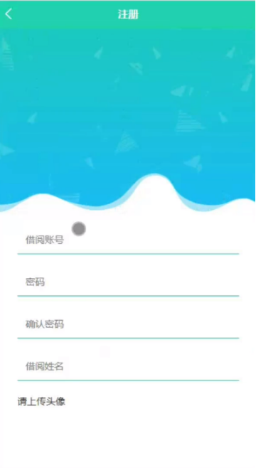
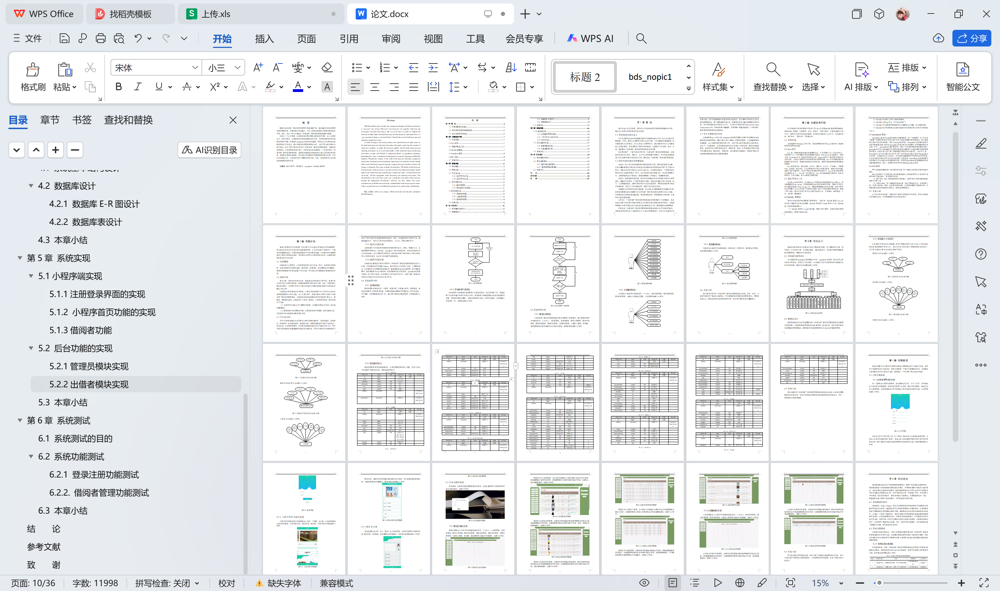

# springboot207-共享书角图书借还管理系统

>  博主介绍：
>  Hey，我是程序员Chaers，一个专注于计算机领域的程序员
>  十年大厂程序员全栈开发‍ 日常分享项目经验 解决技术难题与技术推荐 承接各类网站设计，小程序开发，毕设等。
>  【计算机专业课程设计，毕业设计项目，Java，微信小程序，安卓APP都可以做，不仅仅是计算机专业，其它专业都可以】

## 3000套系统可挑选，获取链接：https://chaerspol.github.io/

<b>QQ【获取完整源码】：674456564</b>

<b>QQ群【获取完整源码】：1058861570</b>

### 系统架构

> 前端：html | js | css | jquery | vue
>
> 后端：springboot | mybatis
> 
> 环境：jdk1.8+ | mysql | maven

# 一、内容包括
包括有  项目源码+项目论文+数据库源码+答辩ppt+远程调试成功

# 二、运行环境

> jdk版本：1.8 及以上； ide工具：IDEA； 数据库: mysql5.7及以上；编程语言: Java

# 三、需求分析

**3.1 系统概述**

该系统由个人管理员，出借者和借阅者三部分组成。其中：借阅者注册登录后，在我的页面可以对图书借阅，图书归还，反馈信息，留言簿等进行详细操作；管理员则是根据不同需求设置了不同功能，可以通过后台管理接口管理借阅者信息。

**3.2 需求分析**

需求分析，也称为软件需求分析、系统需求分析或需求分析工程，是指开发人员经过充分的研究和分析，准确地理解用户和项目在功能、性能、可靠性等方面的具体需求，并将用户的非正式需求表述转化为确定系统必须执行的需求的完整定义的过程[11]。
功能需求分析是系统设计的前提，它要求开发者和用户定义开发什么样的体系和系统需要什么样的功能。本文主要介绍了一种基于微信小程序实现的“共享书角”图书借还管理系统。该系统为借阅者找到图书借还信息提供了更安全、更高效、更便捷的途径。本系统有三个角色：管理员，出借者和借阅者，要求具备以下功能：

（1）借阅者可以浏览主页了解图书信息等，并对图书信息进行借阅、评论或收藏等操作；

（2）管理员通过后台管理员界面，实现对借阅者信息管理，或发布系统公告，让借阅者实时知道最新的图书借还信息。

**3.3 可行性分析**

可行性分析是指通过比较项目的主要内容和支撑条件，如市场需求、资源供应、环境影响、资金筹措情况、盈利能力等，预测项目建成后可能产生的资金、经济效益、社会和环境影响，为项目决策提供依据的综合性系统分析方法。可行性研究报告编制的质量直接影响着投资决策的成，而可行性研究报告编制程序又决定了可行性研究报告能否得到有效执行。因此，必须重视可行性研究工作，提高其编制水平。可行性分析应当具有预见性、公正性、可靠性和科学性。

**3.3.1 技术可行性分析**

本系统是为了为借阅者寻找图书借还提供更加安全、高效、便捷的方式，本系统需要运用到Java、MySQL、springboot、B/S结构等技术，这些技术在国内外已经非常成熟，在大学期间也有所涉及，相关的知识和工具在网络上也可以查到，再加上老师的指导，在技术上的难题可以得到解决。

**3.3.2 经济可行性分析**

该系统的主题是基于微信小程序的“共享书角”图书借还管理系统的设计与实现。开发所需的软件资源是Eclipse。我们可以在它的网站上安装一个免费的版本，这对我们的开发和使用是足够好的。数据库就是MySQL数据库。是开源是免费的，服务器使用Tomcat服务器，浏览器使用日常IE浏览器，springboot框架是开源的。经过可行性评估，软件资源支出符合经济可行性[15]。硬件方面，配备齐全的笔记本电脑作为工具在经济上是可行的。

# 四、功能模块

本次系统采用springboot框架集进行开发，springboot框架是一款企业界主流的软件开发框架，其简化了开发流程，大大缩减了软件开发所需的时间提高了软件的响应速度。系统总体结构图如图。

# 五、效果图展示【部分效果图】

图5-1 注册界面【第一次使用本小程序的使用者，首先是要进行注册，点击“注册”，然后就会进入到注册的页面里面，将借阅者信息录入注册表，确认信息正确后，系统才会进入登录界面，借阅者登录成功后可使用本小程序所提供的所有功能。注册界面如图】

图5-2 登录界面【首先双击打开小程序客户端，连上网络之后会显示出本系统的登录界面，这是进入小程序的初始页面“登录”，能成功进入到该登录界面则代表小程序的开启是成功的，接下来就可以操作本系统所带有的其他所有的功能。登录界面如图5-2所示】

图5-3 小程序首页界面图【小程序首页是借阅者注册登录后进入的第一个界面，在这里，人们能够看到小程序的导航条，内容包括首页，图书信息，我的等。小程序首页界面如图5-3所示。】

图5-4图书信息详情界面图【图书信息：在图书信息页面输入图书编号进行搜索，可以查看到图书详细信息；并根据需要进行收藏操作；图书信息详情如图5-4所示。】

图5-5借阅者功能界面图【借阅者登录成功后，点击“我的”进入我的页面，在我的页面可以对图书借阅，图书归还，反馈信息，留言簿等进行详细操作。借阅者功能界面如图5-5所示。】

图5-6后台登录界面图【后台登录，在登录页面选择需要登录的角色，在通过填写用户名和密码等信息进行登录操作，如图5-6所示。】

图5-7管理员功能界面图【管理员登录进入小程序可以查看到系统首页，个人中心，出借者管理，借阅者管理，图书分类管理，图书信息管理，图书借阅管理，图书归还管理，反馈信息管理，出租收入管理，留言簿，系统管理等功能进行详细操作，如图5-7所示。】

图5-8出借者管理界面图【管理员点击出借者管理；在出借者页面输入出借账号和出借姓名进行查询，新增或删除出借者信息列表，并根据需要对出借者详细信息进行详情、出租收入、修改或删除操作】

图5-9图书信息管理界面图【管理员点击图书信息管理；在图书信息页面输入图书编号和图书名称进行查询或删除图书信息列表，并根据需要对图书详细信息进行详情、修改、查看评论或删除操作；如图5-9所示。】

图5-10图书归还管理界面图【管理员点击图书归还管理；在图书归还页面输入图书编号、图书名称和选择是否通过进行查询或删除图书归还列表，并根据需要对图书归还详细信息进行详情、修改或删除操作；如图5-10所示。】

 <b>完整文章</b>
 
 

## 3000套系统可挑选，获取链接：https://chaerspol.github.io/

<b>QQ【获取完整源码】：674456564</b>

<b>QQ群【获取完整源码】：1058861570</b>

